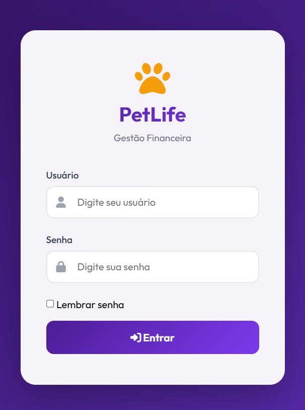
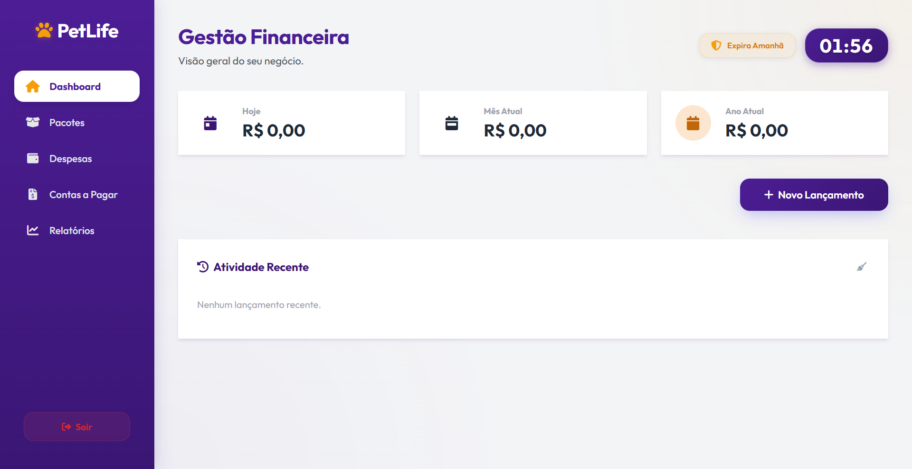
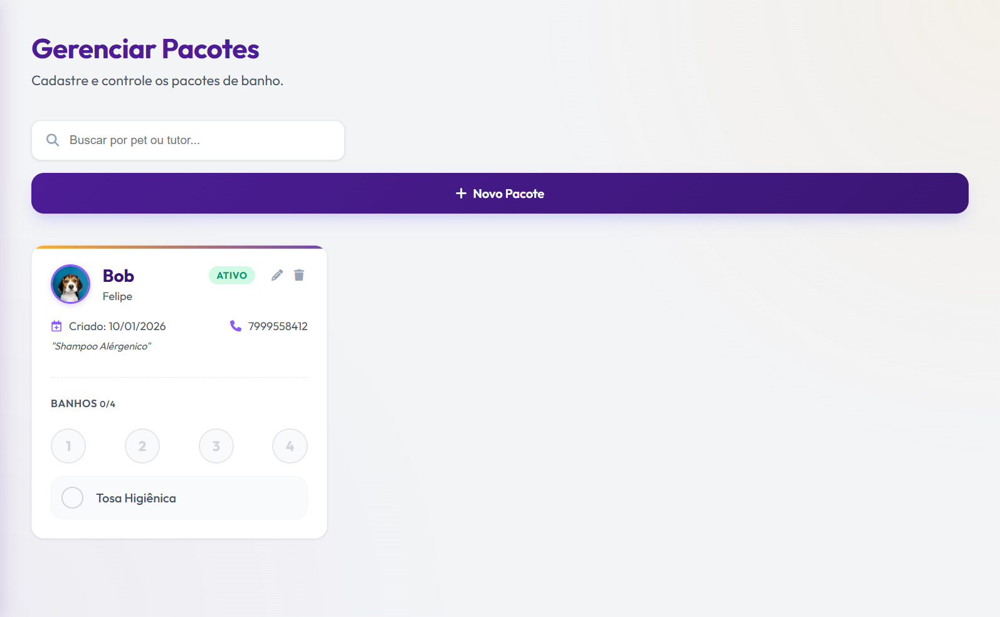
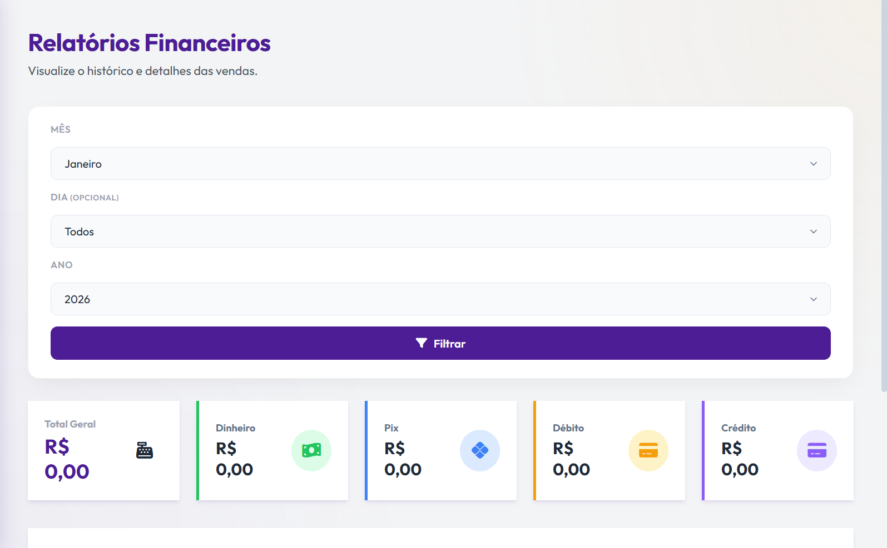

# 🐾 PetLife - Sistema de Gestão para Petshops

<div align="center">


[](https://github.com/davicardoso5524/petlife)
[](LICENSE)
[]()
[](https://www.electronjs.org/)

**Sistema completo de gestão financeira para Petshops com controle de vendas, pacotes, despesas e relatórios.**

[Download](#-instalação) • [Obter Licença](https://petlife-licensing-platform.vercel.app/get-key) • [Documentação](#-funcionalidades)

</div>

---

## ✨ Funcionalidades

### 📊 Dashboard Interativo
- Visão geral de vendas diárias, mensais e anuais
- Gráficos e métricas em tempo real
- Relógio digital integrado

### 💰 Controle de Vendas
- Registro detalhado de vendas
- Múltiplas formas de pagamento (Dinheiro, PIX, Débito, Crédito)
- Histórico completo de transações
- Observações personalizadas

### 📦 Gestão de Pacotes
- Controle de banhos e tosas
- Sistema de renovação automática
- Acompanhamento de uso
- Histórico de renovações

### 💸 Despesas
- Categorização de gastos
- Controle mensal
- Visualização histórica
- Resumos automáticos

### 📋 Contas a Pagar
- Gerenciamento de contas
- Status e vencimentos
- Visão anual por mês
- Alertas de pendências

### 📈 Relatórios
- Análises detalhadas por período
- Exportação de dados
- Filtros personalizados

### 👥 Multi-usuário
- Sistema de autenticação
- Níveis de acesso (Admin/Usuário)
- Gerenciamento de usuários

### 🔐 Licenciamento Integrado
- Ativação online/offline
- Período de graça de 30 dias
- Indicador visual de expiração
- Renovação simplificada

---

## 🚀 Instalação

### Passo 1: Baixar o Instalador

Baixe a versão mais recente do instalador Windows:

👉 **[Download PetLife Setup.exe](https://github.com/davicardoso5524/PetLife/releases/download/v1.0.11/PetLife.Setup.1.0.11.exe)**

> 🆕 **Novidade:** A partir da versão 1.0.1, o PetLife possui **atualização automática**! Você será notificado quando houver novas versões disponíveis.

### Passo 2: Obter Chave de Licença

Obtenha sua chave de licença **GRATUITA**:

👉 **[Obter Chave Gratuita](https://petlife-licensing-platform.vercel.app/get-key)**

> 💡 **Dica:** Você pode obter quantas chaves precisar, cada uma válida por 7 dias!

### Passo 3: Instalar e Ativar

1. ✅ Execute o instalador `PetLife Setup.exe`
2. ✅ Siga as instruções de instalação
3. ✅ Ao abrir o PetLife pela primeira vez, insira sua chave de licença
4. ✅ Pronto! O sistema está pronto para uso

---

## 📸 Screenshots

<div align="center">

### Tela de Login


### Dashboard Principal


### Gestão de Pacotes


### Relatórios


</div>

---

## 🛠️ Tecnologias

<div align="center">

| Tecnologia | Descrição |
|------------|-----------|
|  | Framework desktop multiplataforma |
|  | Backend runtime |
|  | Servidor web |
|  | Banco de dados local |
|  | Linguagem principal |

</div>

---

## 📋 Requisitos do Sistema

| Requisito | Especificação |
|-----------|---------------|
| **Sistema Operacional** | Windows 10 ou superior (64-bit) |
| **Memória RAM** | 4GB (mínimo) |
| **Espaço em Disco** | 500MB |
| **Conexão Internet** | Necessária apenas para ativação inicial |

---

## 🔑 Licenciamento

O PetLife utiliza um sistema de licenciamento online para garantir atualizações e suporte contínuos.

### Como Funciona

1. **Obtenha sua chave gratuita** em: https://petlife-licensing-platform.vercel.app/get-key
2. **Ative no primeiro uso** - processo simples e rápido
3. **Validade de 7 dias** - renove gratuitamente quando expirar
4. **Modo Offline** - funciona offline por até 30 dias após ativação

### Renovação

Quando sua licença estiver próxima da expiração, o sistema exibirá um aviso. Basta obter uma nova chave no mesmo site e reativar!

---

## 🎨 Interface

O PetLife possui uma interface moderna e intuitiva com:

- 🎨 Design premium com tema roxo
- 🌙 Efeitos glassmorphism
- ✨ Animações suaves
- 📱 Layout responsivo
- 🖱️ Navegação intuitiva

---

## 📦 Build do Projeto

Se você deseja compilar o projeto do código-fonte:

```bash
# 1. Clonar o repositório
git clone https://github.com/davicardoso5524/petlife.git
cd petlife

# 2. Instalar dependências
npm install

# 3. Executar em modo desenvolvimento
npm run electron

# 4. Criar instalador
npm run build
```

O instalador será gerado em `dist/PetLife Setup 1.0.1.exe`

---

## 📝 Licença

Este projeto está sob a licença MIT. Veja o arquivo [LICENSE](LICENSE) para mais detalhes.

---

## 👨‍💻 Autor

**Desenvolvido com ❤️ para facilitar a gestão de Petshops**

- 📧 Email: cardosinho524@gmail.com
- 🌐 Website: [petlife-licensing-platform.vercel.app](https://petlife-licensing-platform.vercel.app)

---

## 🤝 Contribuindo

Contribuições são bem-vindas! Se você tem sugestões de melhorias:

1. Fork o projeto
2. Crie uma branch para sua feature (`git checkout -b feature/MinhaFeature`)
3. Commit suas mudanças (`git commit -m 'Adiciona MinhaFeature'`)
4. Push para a branch (`git push origin feature/MinhaFeature`)
5. Abra um Pull Request

---

## 📞 Suporte

Encontrou um bug ou precisa de ajuda?

- 🐛 [Reportar Bug](https://github.com/davicardoso5524/petlife/issues/new?labels=bug)
- 💡 [Solicitar Feature](https://github.com/davicardoso5524/petlife/issues/new?labels=enhancement)
- 📧 Email: cardosinho524@gmail.com

---

## 🗺️ Roadmap

### ✅ Concluído
- [x] Sistema de atualização automática
- [x] Licenciamento integrado
- [x] Gestão completa de vendas e pacotes

### 🚧 Em Desenvolvimento
- [ ] Versão para macOS
- [ ] Versão para Linux
- [ ] Backup automático na nuvem
- [ ] Integração com WhatsApp
- [ ] App mobile (Android/iOS)
- [ ] Modo escuro

---

## ⭐ Agradecimentos

Se este projeto foi útil para você, considere dar uma estrela! ⭐

Isso ajuda outros a descobrirem o PetLife e motiva o desenvolvimento contínuo.

---

<div align="center">

**[⬆ Voltar ao topo](#-petlife---sistema-de-gestão-para-petshops)**

Made with 💜 by PetLife Team

</div>
